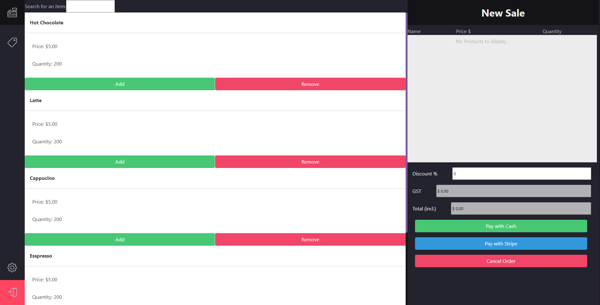
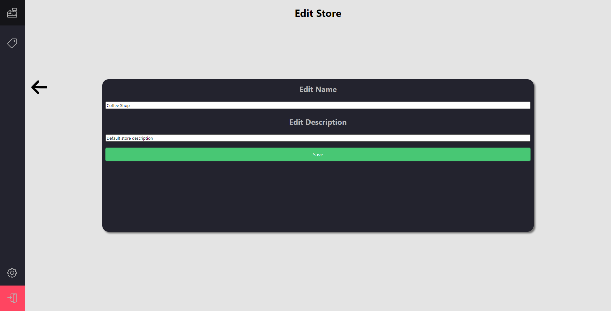
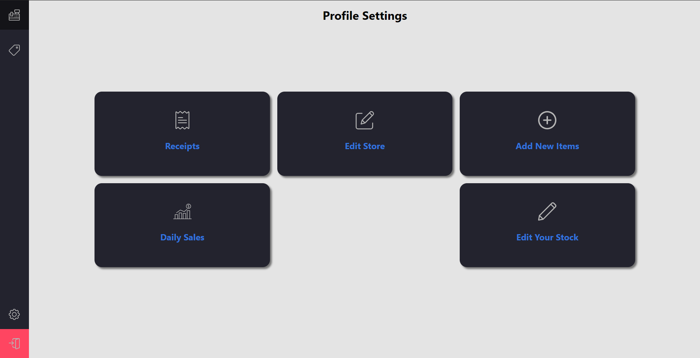
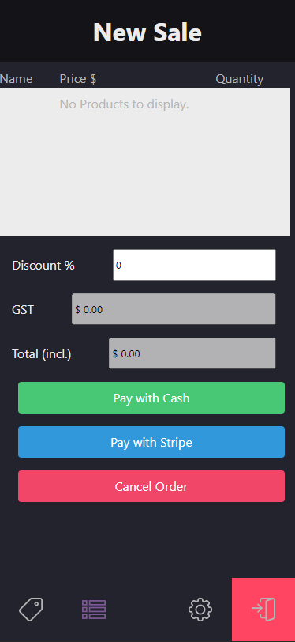
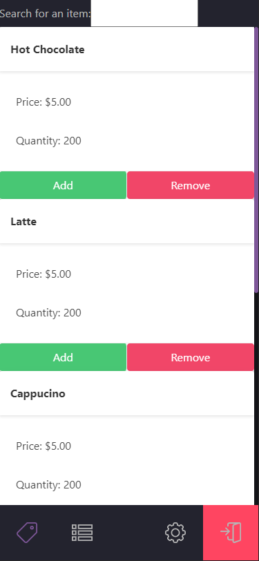

# AnyPOS

## Table of Contents

- [Overview](#overview)
- [Technologies](#technologies-used)
- [Screenshots](#Screenshots-of-the-app)
- [Links](#Links)
- [License](#license)

## Overview
A Mobile responsive react web-application designed for businesses of all sizes to use to track stock-levels, profit-margin and handle cash processing.

---

## Technologies used
- TypeScript
- JavaScript
- ESLint AirBnB Configuration
- SASS
- React
- Express
- MySQL
- Sequelize
- Bcrypt
- Axios
- BootStrap
- Figma

---

## Links:

1. Deployed :  [Here](https://anyPOS.herokuapp.com/)

2. GitHub repo:  [Here](https://github.com/Travis-Witts/AnyPOS)
---

## Screenshots of the app:
  Desktop version:

Mobile version:

  

    

---
## License
This project is licensed under the terms of MIT License.
